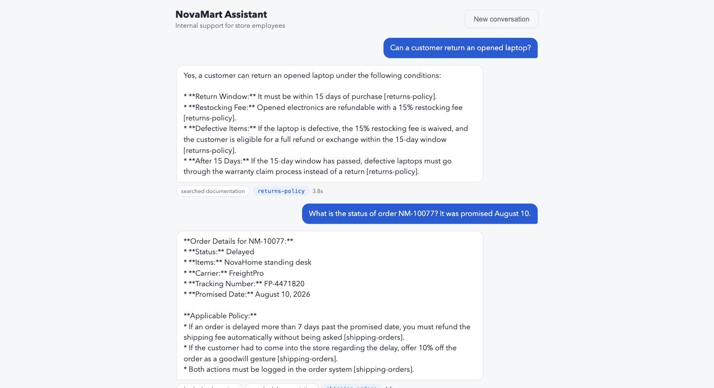
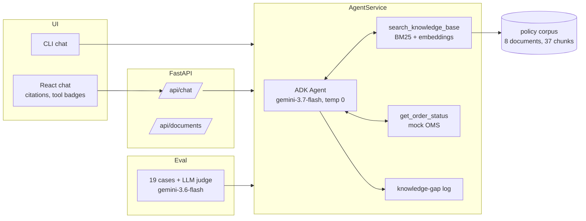

# NovaMart Assistant

An internal AI assistant for NovaMart store employees. It answers policy questions
(returns, refunds, warranties, discounts) grounded in company documentation with
per-fact citations, looks up live order status through an internal API, and declines
to answer when the documentation does not cover the question, logging every refusal
as a documentation gap for the policy team.

Built on the Google AI stack: a Gemini agent (Agent Development Kit) with hybrid
retrieval, a FastAPI service, a React front end, an LLM-judged evaluation suite, and
Terraform-managed deployment on Cloud Run.

Live demo: https://novamart-assistant-nnai7kjpiq-uc.a.run.app (scale-to-zero, so the
first request after idle takes a few extra seconds).

## Quickstart

Requires Python 3.12+ with [uv](https://docs.astral.sh/uv/), and a
[Google AI Studio API key](https://aistudio.google.com/apikey) (the free tier works).

```bash
uv sync
cp .env.example .env        # paste your GOOGLE_API_KEY
make index                  # embed the policy corpus (~seconds)
make chat                   # talk to the agent in the terminal
```

For the web UI:

```bash
cd frontend && npm ci && npm run build && cd ..
make dev                    # serves API + UI on http://localhost:8000
```

Other targets: `make test` (hermetic unit tests, no API calls), `make eval` (live
evaluation suite, writes eval/report.md), `make search q="..."` (inspect retrieval).



## Architecture



One entry point, `AgentService`, serves the CLI, the HTTP API, and the eval harness,
so what gets evaluated is exactly what users get.

## Key decisions

- **Agentic RAG, not a fixed pipeline.** Retrieval is a tool the model calls, so it
  decides per turn whether to search policy, hit the order system, both (a delayed
  order triggers a documented goodwill policy), or neither (follow-ups reuse session
  memory).
- **Hybrid retrieval.** Hand-rolled Okapi BM25 blended 50/50 with
  gemini-embedding-001 cosine similarity. Pure vector search fumbles exact tokens
  (order numbers, "NovaCare"); pure keyword misses paraphrase ("get my money back"
  never says refund). No vector database: 37 chunks fit in memory, and the
  production note names the managed path.
- **Grounding is enforced around the model, not just requested of it.** The
  instruction mandates per-fact citations and a fixed refusal phrase; the service
  independently classifies any answer with no citation and no successful order
  lookup as ungrounded. Refusals are logged as documentation gaps: a decline is only
  useful if it tells the policy team what is missing.
- **Deterministic where it should be.** The agent runs at temperature 0: a policy
  assistant should give the same answer on every shift. Models are pinned
  explicitly; library defaults currently point at preview models.
- **Two auth backends, deliberately.** Local development uses an AI Studio API key
  (one env var, the case names it sufficient, evaluators can run this in minutes).
  The deployed service authenticates through the Vertex backend with its service
  account: no API key exists in the infrastructure. Both SDKs flip backends via env
  vars with zero code change.
- **The eval suite is the contract.** 19 cases across grounded, tool, refusal, and
  adversarial buckets; deterministic checks where truth is exact, a pinned LLM judge
  for correctness and groundedness. The first run scored 16/19 and forced real
  fixes: a citation-parser gap, a category-borrowing instruction weakness, and later
  a judge false negative that forced a judge upgrade. Full history in the PR trail;
  final committed run in [eval/report.md](eval/report.md): **19/19, latency p50
  ~3.5s**.

## Evaluation results

| Bucket | Cases | Passed |
|---|---|---|
| grounded | 9 | 9 |
| tool | 4 | 4 |
| refusal | 3 | 3 |
| adversarial | 3 | 3 |

Refusals are graded as first-class behavior: inventing policy is the one failure an
internal assistant cannot afford.

## Deployment

`infra/` holds the Terraform: Artifact Registry, a dedicated runtime service
account with `roles/aiplatform.user`, and a scale-to-zero Cloud Run service (min 0,
public, 512Mi). The container builds the embedding index at boot and serves the API
plus the built frontend. Idle cost is $0 on Cloud Run's request-based free tier.

```bash
gcloud builds submit --tag <region>-docker.pkg.dev/<project>/novamart/app:<tag>
cd infra && terraform apply -var project_id=<project> -var image=<image>
```

## What I would do with more time

- Stream tokens over SSE (ADK's run_async already yields incrementally; the UI
  renders complete turns today).
- Wire `make eval` into CI behind a budget flag as the regression gate the
  production note describes, with a small paid-tier key and pass-rate threshold.
- Retrieval evaluation separate from end-to-end: recall@k against a labeled query
  set, so retrieval and generation regressions are distinguishable.
- Session persistence (ADK's session service supports SQLite/Postgres) so
  conversations survive instance restarts on Cloud Run.
- An admin view over the knowledge-gap log: cluster refused questions, draft
  candidate policy pages for human review, per the production note's loop.

## Production

The one-page production architecture note is in
[production_note.md](production_note.md): Gemini Enterprise for the managed
knowledge surface, this custom agent on Agent Runtime for the tool workflows,
connector-based data with ACL-aware retrieval, BigQuery logging, and the eval suite
as a CI regression gate with online sampling.
